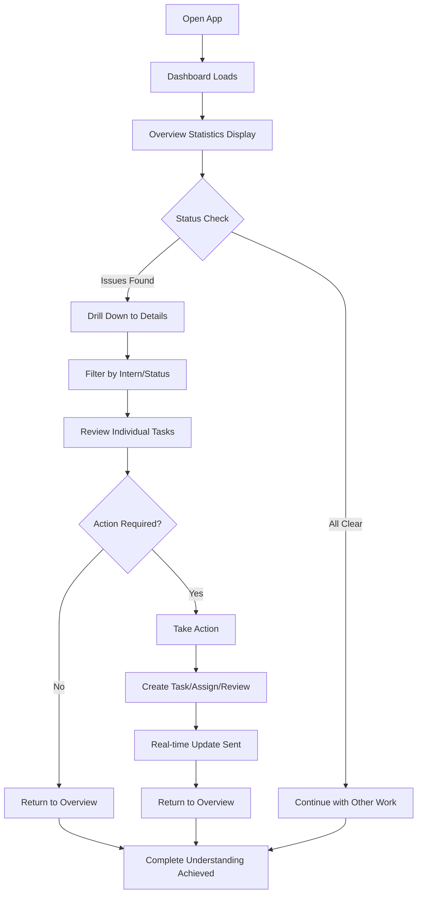
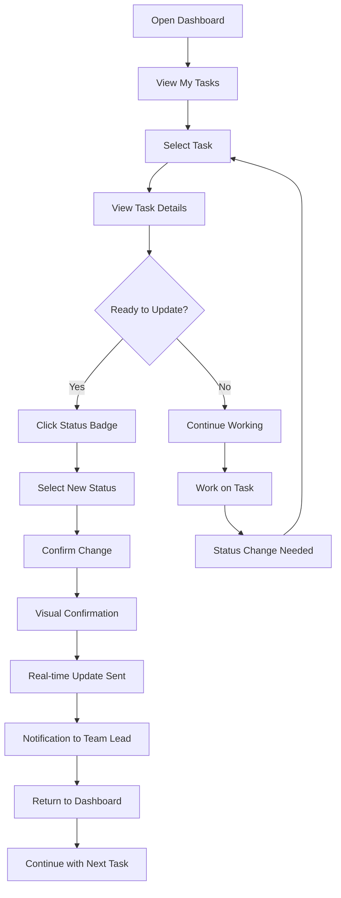
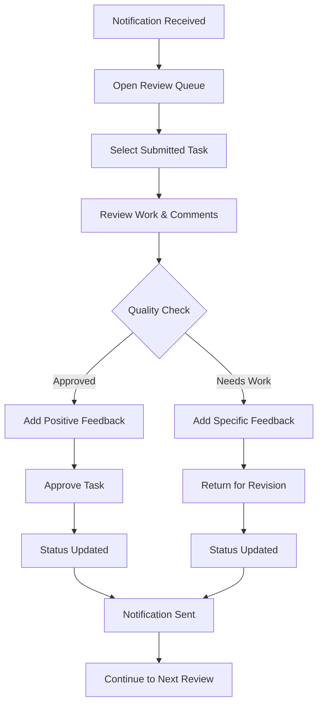
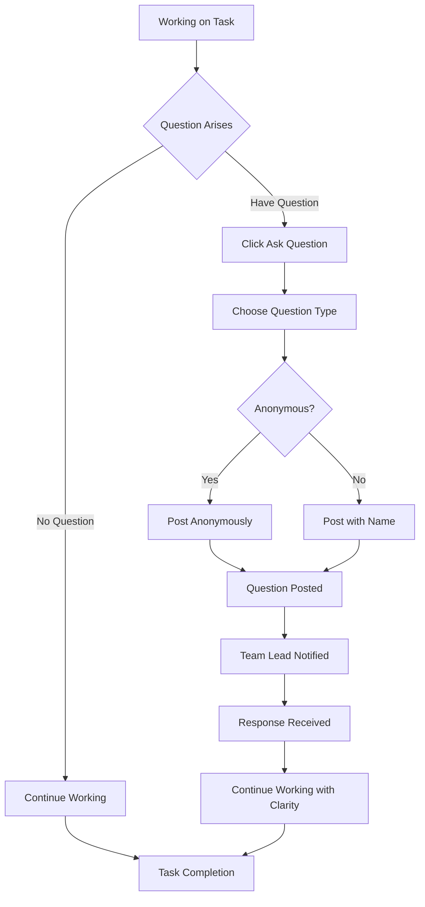

# UX Design Specification t2

**Author:** ShaeelaHussain
**Date:** 2026-02-16

---

<!-- UX design content will be appended sequentially through collaborative workflow steps -->

## Executive Summary

### Project Vision

The t2 project transforms intern task management from spreadsheet-based tracking to an intuitive web application that provides instant visibility, streamlined communication, and organized progress tracking. The system aims to reduce administrative overhead for Team Leads while creating a supportive, clear environment for interns to develop their skills and complete meaningful work.

### Target Users

**Team Leads** (Primary Users):
- Senior developers mentoring 4-6 interns per cohort
- Time-constrained professionals juggling multiple responsibilities
- Need comprehensive oversight with minimal time investment
- Value efficiency, clear communication, and educational feedback

**Interns** (Secondary Users):
- New team members in first weeks/months of employment
- Often uncertain about expectations and hesitant to ask questions
- Need clear task organization, feedback, and communication channels
- Value structure, guidance, and safe learning environments

### Key Design Challenges

**Information Density vs. Clarity**: Team Leads need comprehensive visibility across multiple interns and tasks without cognitive overload. Dashboard must present rich data in scannable, actionable formats.

**Real-time Collaboration**: Status changes and communications must update instantly across all users while maintaining focus and avoiding notification fatigue.

**Dual-Persona Experience**: Single application must serve fundamentally different needs - administrative oversight for Team Leads versus task-focused interaction for Interns.

**Corporate Environment Compliance**: Must integrate with existing SSO systems and function reliably across corporate browser environments while maintaining modern UX expectations.

### Design Opportunities

**Psychological Safety Through Design**: Create interfaces that encourage questions and learning by reducing communication anxiety and making feedback feel supportive rather than evaluative.

**Efficiency Through Visualization**: Replace spreadsheet mental models with intuitive visual patterns that enable rapid comprehension of team status and individual progress.

**Educational Workflow Integration**: Design the review and feedback process to be not just administrative but also developmental, helping interns grow through clear, actionable guidance.

**Progressive Enhancement**: Leverage modern web capabilities while ensuring core functionality remains accessible across all corporate technology environments.

## Core User Experience

### Defining Experience

The core experience of t2 centers on **instant team visibility** - replacing the mental overhead of spreadsheet tracking with an at-a-glance understanding of intern progress. The primary value proposition is transforming "Where are we on everything?" from a 5-minute spreadsheet hunt to a 30-second dashboard scan. This experience must feel both comprehensive and effortless, giving Team Leads confidence while reducing interns' anxiety about status reporting.

### Platform Strategy

**Primary Platform**: Web application (desktop-first design)
- Corporate environments predominantly use desktop computers
- Mouse/keyboard interaction optimized for efficiency and data entry
- Large screen real estate supports comprehensive dashboard views
- Touch support secondary for tablet compatibility

**Technical Considerations**:
- Progressive Web App capabilities for offline task viewing
- Responsive design for tablet/mobile access during meetings
- Corporate browser compatibility (Chrome, Edge, Firefox, Safari)
- SSO integration through existing corporate authentication systems

### Effortless Interactions

**Status Updates Should Be Effortless**: One-click status changes that instantly update across all users. No forms, no confirmation dialogs, no page reloads. The interaction should feel as natural as flipping a light switch.

**Task Assignment Should Be Effortless**: Drag-and-drop or simple dropdown assignment that eliminates the multi-step process of spreadsheet entry. Team Leads should assign tasks while reading them, not as a separate administrative action.

**Question Asking Should Be Effortless**: Interns should ask questions within task context as easily as typing in a chat. No separate email, no finding the right person, no wondering if they're bothering someone.

**Dashboard Loading Should Be Effortless**: Opening the app should show current status instantly, even before data fully loads. Skeleton screens and progressive loading should create the perception of instant access.

### Critical Success Moments

**The "Morning Dashboard" Moment**: Team Lead opens the app Monday morning and sees exactly where everything stands. This is the moment they realize the system saves them time and reduces mental overhead. Success = complete understanding in under 30 seconds.

**The "First Question" Moment**: Intern asks their first question within a task instead of via email or Slack. This is the moment they feel safe asking for help. Success = question asked without hesitation or anxiety.

**The "Real-time Update" Moment**: Team Lead sees an intern's status change instantly on their dashboard. This is the moment they trust the system to keep them informed. Success = no manual refresh needed, information just appears.

**The "First Approval" Moment**: Team Lead approves submitted work with inline feedback. This is the moment they experience the streamlined review workflow. Success = review completed in under 2 minutes with clear feedback delivered.

**The "Cohort Transition" Moment**: Team Lead sets up new interns and archives old cohort seamlessly. This is the moment they realize the system scales with their program. Success = transition completed in under 15 minutes with all data preserved.

### Experience Principles

**Instant Visibility Over Detailed Information**: Prioritize showing users what they need to know immediately. Details should be available on demand, not presented by default. Dashboard first, details second.

**Contextual Communication Over Separate Channels**: All task-related communication should happen within task context. Eliminate the need to switch between email, Slack, and spreadsheets for task discussions.

**Real-time Confidence Over Manual Verification**: Users should trust that what they see is current. Real-time updates create confidence and eliminate the need to manually verify information.

**Psychological Safety Over Administrative Efficiency**: Design interactions that reduce anxiety and encourage learning. Make it easy to ask questions, admit uncertainty, and request help without fear of judgment.

**Progressive Disclosure Over Information Overload**: Start with high-level summaries and allow users to drill down for details. Information architecture should guide users from overview to specifics naturally.

## Desired Emotional Response

### Primary Emotional Goals

**For Team Leads: Confident Control**
Team Leads should feel in complete control of their intern program with confidence that nothing is falling through the cracks. The primary emotion is relief - the mental burden of tracking and chasing is lifted, replaced by effortless oversight. They should feel competent and effective, with the system making them look good at their job.

**For Interns: Safe Progress**
Interns should feel psychologically safe to learn, ask questions, and make progress without fear of judgment. The primary emotion is confidence - they know exactly what's expected and can safely admit uncertainties. They should feel supported and guided, not monitored and evaluated.

### Emotional Journey Mapping

**First Discovery (Team Lead):** Skepticism → Curiosity → Relief
- Initial doubt about replacing spreadsheets
- Growing curiosity as dashboard shows immediate value
- Relief when realizing the time savings and clarity provided

**First Discovery (Intern):** Anxiety → Clarity → Confidence
- Initial worry about new system and expectations
- Clarity when seeing organized tasks and clear priorities
- Confidence when understanding they can ask questions safely

**Core Experience (Daily Use):** Efficiency → Trust → Accomplishment
- Efficiency in getting status quickly and acting on it
- Trust that information is current and complete
- Accomplishment in managing team or completing work effectively

**Task Completion:** Pride → Recognition → Growth
- Pride in submitting completed work
- Recognition through timely feedback and approval
- Growth from clear, actionable guidance for improvement

**Error/Problem Moments:** Confusion → Support → Resolution
- Initial confusion when something goes wrong
- Support through clear error messages and help
- Resolution with learning and confidence restored

### Micro-Emotions

**Confidence Over Confusion**: Every interaction should build user confidence through clear feedback and predictable outcomes. Avoid ambiguous states or unclear next steps.

**Trust Over Skepticism**: Real-time updates, consistent behavior, and reliable notifications build trust. Avoid surprising changes or unexplained system behavior.

**Calm Over Anxiety**: Reduce status anxiety through instant visibility and clear communication. Avoid deadline pressure or uncertainty about expectations.

**Accomplishment Over Frustration**: Status changes and task completion should feel satisfying. Avoid dead-end interactions or confusing workflows.

**Belonging Over Isolation**: Communication features should create connection, not isolation. Avoid making interns feel like they're working alone or bothering others.

### Design Implications

**To Create Confidence:**
- Clear visual feedback for every action
- Predictable interaction patterns
- Consistent status indicators
- Undo/redo capabilities for error recovery

**To Create Trust:**
- Real-time updates visible to all users
- Transparent notification history
- Reliable email delivery confirmations
- Audit trails for all changes

**To Create Psychological Safety:**
- Question-asking interfaces that feel like chat, not formal requests
- Anonymous question options for sensitive topics
- Feedback framed as guidance, not criticism
- Celebrating learning and progress, not just completion

**To Create Efficiency:**
- One-click status changes
- Keyboard shortcuts for frequent actions
- Smart defaults and auto-completion
- Progressive disclosure of information

### Emotional Design Principles

**Clarity Creates Confidence**: Every interface element should be immediately understandable. Clear visual hierarchy, consistent terminology, and obvious interaction patterns build user confidence.

**Transparency Builds Trust**: Show users what's happening behind the scenes. Real-time updates, notification status, and clear system feedback create trust in the product's reliability.

**Safety Enables Learning**: Design interactions that make it safe to admit uncertainty and ask for help. Remove judgment from error states and frame all feedback as developmental.

**Efficiency Creates Delight**: When users accomplish tasks faster and easier than expected, it creates delight. Focus on reducing friction in high-frequency interactions.

**Recognition Drives Engagement**: Acknowledge user actions and progress. Celebrate completions, recognize questions asked, and show the impact of user contributions to the team.

## UX Pattern Analysis & Inspiration

### Inspiring Products Analysis

**Slack: Real-time Team Communication**
- **Core Problem**: Eliminates email overload for team communication
- **UX Success**: Threaded conversations keep discussions organized and searchable
- **Onboarding**: Welcoming interface with clear channel setup and bot guidance
- **Navigation**: Sidebar navigation with intuitive keyboard shortcuts
- **Innovative Interactions**: Emoji reactions, @mentions, and slash commands create rich communication
- **Visual Design**: Clean, playful design with customizable themes and clear status indicators
- **Error Handling**: Graceful connection loss handling with clear offline indicators

**GitHub: Project Management for Developers**
- **Core Problem**: Provides visibility into code changes and project progress
- **UX Success**: Dashboard shows personalized relevant information without overwhelming
- **Onboarding**: Progressive disclosure - starts simple, reveals complexity as needed
- **Navigation**: Tab-based navigation with clear information hierarchy
- **Innovative Interactions**: Pull request workflow with inline commenting and diff visualization
- **Visual Design**: Clean, professional design with excellent use of whitespace and typography
- **Error Handling**: Clear error messages with actionable next steps and context

**Notion: Flexible Workspace Organization**
- **Core Problem**: Replaces multiple tools with one flexible workspace
- **UX Success**: Block-based editing makes content creation feel like building with LEGO
- **Onboarding**: Template gallery shows possibilities without overwhelming new users
- **Navigation**: Hierarchical sidebar with drag-and-drop organization
- **Innovative Interactions**: Slash commands, database views, and linked databases create powerful workflows
- **Visual Design**: Minimalist design puts content first with subtle, delightful micro-interactions
- **Error Handling**: Auto-save with version history eliminates fear of losing work

**Linear: Issue Tracking with Delight**
- **Core Problem**: Makes issue tracking feel fast and satisfying rather than bureaucratic
- **UX Success**: Command palette interface makes power users incredibly efficient
- **Onboarding**: Clean, focused interface with excellent keyboard shortcut discovery
- **Navigation**: Speed-first navigation with keyboard-driven workflows
- **Innovative Interactions**: Issue state transitions with satisfying animations and sound effects
- **Visual Design**: Beautiful, minimalist design with excellent use of color and motion
- **Error Handling**: Optimistic updates with graceful rollback on errors

### Transferable UX Patterns

**Navigation Patterns:**

- **Command Palette (Linear/Slack)** - Perfect for Team Leads who need quick access to common actions like creating tasks or finding interns
- **Sidebar Navigation (Slack/GitHub)** - Natural fit for dashboard-centric application with clear sections for tasks, users, and settings
- **Tab-based Organization (GitHub)** - Excellent for switching between different views (dashboard, tasks, reviews) without losing context

**Interaction Patterns:**

- **Real-time Updates (Slack)** - Essential for the "instant visibility" core experience, shows status changes without page reload
- **Inline Commenting (GitHub)** - Perfect for task feedback and question threads within task context
- **Keyboard Shortcuts (Linear/Slack)** - Supports efficiency goals for power users while remaining discoverable
- **Progressive Disclosure (Notion/GitHub)** - Aligns with "instant visibility over detailed information" principle

**Visual Patterns:**

- **Status Indicators (Slack)** - Color-coded badges and icons support quick status scanning for Team Leads
- **Clean Typography (GitHub/Linear)** - Professional appearance supports corporate environment while remaining readable
- **Micro-interactions (Linear/Notion)** - Subtle animations and transitions create delight without being distracting
- **Whitespace Usage (GitHub/Notion)** - Creates calm, focused interface that reduces cognitive load

### Anti-Patterns to Avoid

**Information Overload (Jira)**: Complex dashboards with too many widgets create cognitive burden rather than clarity
**Form-heavy Interactions (Traditional PM tools)**: Multi-page forms for task creation create friction and reduce adoption
**Corporate Sterility (Old Enterprise Software)**: Cold, impersonal interfaces fail to create psychological safety for learning
**Notification Spam (Some Collaboration Tools)**: Over-notification desensitizes users and makes them ignore important updates
**Rigid Workflows (Traditional Tools)**: Inflexible status transitions don't match real-world team dynamics

### Design Inspiration Strategy

**What to Adopt:**

- **Command Palette Interface** - because it supports Team Lead efficiency and quick access to frequent actions
- **Real-time Update Model** - because it's essential for instant visibility and confidence in data freshness
- **Progressive Disclosure Architecture** - because it aligns with dashboard-first, details-on-demand approach
- **Clean Professional Design** - because it fits corporate environment while remaining approachable

**What to Adapt:**

- **Slack's Threaded Conversations** - adapt for task-specific question threads to keep communication contextual
- **GitHub's Pull Request Workflow** - simplify for task review/approval process with inline feedback
- **Linear's Keyboard-First Approach** - modify to include mouse-friendly options for less technical users
- **Notion's Block-Based Editing** - simplify for task descriptions and requirements without overwhelming complexity

**What to Avoid:**

- **Complex Dashboard Widgets** - conflicts with instant visibility goal and creates cognitive overhead
- **Multi-Page Forms** - doesn't align with effortless interaction principles
- **Corporate Color Schemes** - avoid cold, impersonal designs that don't support psychological safety
- **Excessive Notifications** - conflicts with calm, focused emotional goals

## Design System Foundation

### Design System Choice

**Tailwind UI + Custom Components**

We're choosing Tailwind UI as our foundation with strategic custom components for unique t2 requirements. This approach leverages our existing Tailwind CSS choice while providing professional, proven components that we can customize to match our emotional design goals.

### Rationale for Selection

**Technical Alignment**
- Builds on existing Tailwind CSS choice from architecture decisions
- Perfect compatibility with Next.js 15 and TypeScript
- Utility-first approach supports rapid iteration and customization

**Corporate Compatibility**
- Professional, clean aesthetic appropriate for enterprise environments
- Extensive component library covers dashboard, forms, and communication needs
- Built-in accessibility support meets WCAG requirements

**Design Flexibility**
- Easy customization to support psychological safety and confidence-building goals
- Design token system allows consistent emotional color application
- Component composition enables unique patterns while maintaining consistency

**Team Considerations**
- Intermediate skill level can handle Tailwind's learning curve
- Strong documentation and community support
- Performance characteristics support 2-second dashboard load requirement

### Implementation Approach

**Phase 1: Foundation Setup**
- Install and configure Tailwind UI components
- Establish design token system (colors, typography, spacing)
- Create base component library with t2 branding

**Phase 2: Custom Component Development**
- Task status components with real-time update capabilities
- Communication interfaces optimized for psychological safety
- Dashboard layouts optimized for instant visibility

**Phase 3: Pattern Refinement**
- Micro-interactions and animations for delight without distraction
- Responsive patterns for tablet/mobile access
- Accessibility enhancements for screen reader support

### Customization Strategy

**Design Token System**
- **Primary Colors**: Professional blue palette with confidence-building accents
- **Status Colors**: Clear, accessible color system for task states (To Do, In Progress, Submitted, Approved, Returned)
- **Typography**: Clean, readable font system optimized for corporate environments
- **Spacing**: Consistent spacing scale supporting calm, focused interfaces

**Component Customization Priorities**
- **Task Cards**: Enhanced with status indicators, progress visualization, and question-thread integration
- **Dashboard Layout**: Optimized for instant team visibility with progressive disclosure
- **Communication Components**: Chat-like interfaces within task context for psychological safety
- **Status Indicators**: Real-time badges and progress bars supporting trust and confidence

**Brand Integration**
- Maintain professional corporate appearance while adding approachable elements
- Use color and typography to support emotional goals (confidence, safety, clarity)
- Incorporate subtle micro-interactions that create delight without being distracting
- Ensure all customizations enhance rather than compromise accessibility

## 2. Core User Experience

### 2.1 Defining Experience

**"See Everything, Change Anything, Instantly"**

The defining experience of t2 is the **real-time dashboard scan** - Team Leads open the app and instantly see complete team status, then make changes that update immediately across all users. This combines the comprehensive visibility of a spreadsheet with the instant gratification of real-time collaboration.

**Core Action Statement:** "Open the dashboard, see exactly where everyone stands, and update anything with one click."

This is the interaction users will describe to colleagues: "I can see my entire team's progress in 30 seconds and update anything instantly - no more hunting through spreadsheets or sending follow-up emails."

### 2.2 User Mental Model

**Current Mental Model (Spreadsheets):**
- Status lives in cells that require manual hunting
- Updates require email/Slack communication
- Information is stale until manually refreshed
- Progress tracking is separate from task management

**Desired Mental Model (t2):**
- Status is visible at a glance like a team heartbeat
- Updates happen instantly and automatically
- Information is always current and trustworthy
- Progress and tasks are the same thing

**User Expectations:**
- Dashboard should load faster than opening a spreadsheet
- Status changes should be as easy as changing a cell value
- Real-time updates should feel like chat, not database queries
- Finding information should be visual, not text-based

**Confusion Points to Address:**
- Understanding real-time vs. cached data
- Knowing who can see what (role-based visibility)
- Trusting that updates actually saved
- Finding specific tasks in large lists

### 2.3 Success Criteria

**"This Just Works" Indicators:**
- Dashboard loads and shows current status before user finishes coffee sip
- One-click status changes that never require confirmation dialogs
- Real-time updates that appear instantly on other users' screens
- Search/find that works as fast as typing

**Smart/Accomplished Feelings:**
- Team Lead: "I knew exactly what to do without thinking"
- Intern: "I could ask for help without feeling stupid"
- Both: "The system anticipated what I needed next"

**Success Feedback:**
- Visual confirmation (color changes, checkmarks) for every action
- Real-time presence indicators showing other users' activity
- Smooth animations that make updates feel magical
- Undo/redo capabilities that eliminate fear of mistakes

**Performance Expectations:**
- Dashboard load: <2 seconds
- Status update: <1 second to all users
- Search results: <500ms
- Task creation: <3 seconds from idea to saved

**Automatic Behaviors:**
- Status changes trigger email notifications automatically
- Task assignments appear on intern dashboards instantly
- Dashboard refreshes without user action
- Question threads notify relevant people automatically

### 2.4 Novel UX Patterns

**Primary Pattern: Real-time Collaborative Dashboard**
- **Established Elements**: Card-based layouts, status badges, filter controls
- **Novel Combination**: Real-time updates + role-based views + psychological safety features
- **Innovation**: Status changes that feel like chat messages rather than database transactions

**Secondary Pattern: Contextual Communication**
- **Established Elements**: Comment threads, @mentions, notifications
- **Novel Combination**: Task-context questions + anonymous options + learning-focused framing
- **Innovation**: Question-asking that feels like brainstorming, not evaluation

**Educational Approach:**
- Use familiar spreadsheet metaphors (cells, rows, filters) but make them interactive
- Leverage chat app patterns for real-time updates and presence
- Apply project management tool patterns for task organization but simplify for intern context

### 2.5 Experience Mechanics

**1. Dashboard Initiation:**
- **Trigger**: User opens app or navigates to dashboard
- **Invitation**: Skeleton screens appear instantly, then populate with real data
- **Mental Model**: Like opening a spreadsheet that's already filled with current information

**2. Core Interaction - Status Update:**
- **Initiation**: User clicks status badge or dropdown on any task card
- **Interaction**: One-click selection from status options (To Do → In Progress → Submitted → Approved/Returned)
- **Feedback**: Color change + animation + real-time update to all connected users
- **System Response**: Email notification sent, dashboard updated, audit trail logged

**3. Core Interaction - Task Assignment:**
- **Initiation**: Team Lead clicks "Assign" button or uses drag-and-drop
- **Interaction**: Select intern from dropdown with current workload visibility
- **Feedback**: Task moves to assigned intern's section with animation
- **System Response**: Intern receives notification, dashboard updates, assignment recorded

**4. Core Interaction - Question Asking:**
- **Initiation**: Intern clicks "Ask Question" within task context
- **Interaction**: Chat-like interface appears with typing indicator
- **Feedback**: Question appears instantly with timestamp and notification
- **System Response**: Team Lead notified, question threaded with task, anonymous option available

**5. Completion Flow:**
- **Success Indicators**: Visual confirmation, updated statistics, smooth transitions
- **Next Steps**: Related tasks suggested, dashboard returns to updated state
- **Learning Integration**: Feedback framed developmentally, progress acknowledged
- **Trust Building**: All actions visible in audit trail, nothing feels hidden

## Visual Design Foundation

### Color System

**Professional Confidence Palette**
Based on our emotional goals of confidence, safety, and clarity, we'll use a professional blue-centric palette with warm accents for psychological safety.

**Primary Colors:**
- **Primary Blue**: #3B82F6 (Trust, reliability, confidence)
- **Primary Dark**: #1E40AF (Authority, focus)
- **Primary Light**: #93C5FD (Approachability, calm)

**Status Colors (Semantic):**
- **Success Green**: #10B981 (Completed tasks, achievement)
- **Warning Yellow**: #F59E0B (In progress, attention needed)
- **Error Red**: #EF4444 (Returned tasks, urgency)
- **Neutral Gray**: #6B7280 (Secondary information)

**Psychological Safety Colors:**
- **Safe Purple**: #8B5CF6 (Question asking, learning)
- **Warm Orange**: #F97316 (Feedback, guidance)
- **Calm Teal**: #14B8A6 (Support, help)

**Neutral Foundation:**
- **Background**: #F9FAFB (Clean, focused)
- **Surface**: #FFFFFF (Cards, modals, content areas)
- **Border**: #E5E7EB (Subtle separation)

**Accessibility Compliance:**
All color combinations meet WCAG AA contrast ratios (4.5:1 for normal text, 3:1 for large text). Status colors are reinforced with icons and text labels.

### Typography System

**Primary Typeface: Inter**
- Modern, highly readable sans-serif optimized for UI
- Excellent corporate compatibility and web performance
- Multiple weights support clear information hierarchy

**Type Scale:**
- **H1**: 32px, 600 weight (Page titles, main headers)
- **H2**: 24px, 600 weight (Section headers, card titles)
- **H3**: 20px, 500 weight (Subsection headers, task titles)
- **Body**: 16px, 400 weight (Primary content, descriptions)
- **Small**: 14px, 400 weight (Secondary text, metadata)
- **Caption**: 12px, 400 weight (Labels, timestamps)

**Line Heights:**
- Headings: 1.2 (tight, scannable)
- Body text: 1.5 (comfortable reading)
- Small text: 1.4 (maintained readability)

**Typography Principles:**
- Clear hierarchy supporting dashboard scanning
- Excellent readability for task descriptions and feedback
- Professional appearance appropriate for corporate environment
- Web font optimization for fast loading

### Spacing & Layout Foundation

**Spacing Unit: 4px Base**
- **XS**: 4px (tight spacing, icon padding)
- **SM**: 8px (related elements, button padding)
- **MD**: 16px (standard spacing, component margins)
- **LG**: 24px (section spacing, card padding)
- **XL**: 32px (page margins, major sections)
- **2XL**: 48px (page layout, dashboard sections)

**Layout Principles:**
- **Breathing Room**: Generous whitespace reduces cognitive load and supports calm, focused interaction
- **Visual Hierarchy**: Spacing creates clear information groups and scan patterns
- **Consistent Rhythm**: 4px grid ensures alignment and professional appearance
- **Responsive Scaling**: Spacing adjusts proportionally across screen sizes

**Grid System:**
- **12-column grid** for complex layouts (dashboard, task management)
- **8-column grid** for simpler layouts (forms, modals)
- **Component-based** spacing for consistent internal layouts
- **Flexbox-first** approach for responsive behavior

**Component Spacing Patterns:**
- **Card Layout**: 24px padding, 16px between elements
- **Form Layout**: 16px between fields, 8px between label and input
- **Navigation**: 32px sections, 16px between items
- **Dashboard**: 48px sections, 24px between widgets

### Accessibility Considerations

**Color Accessibility:**
- All interactive elements meet 4.5:1 contrast minimum
- Status information conveyed through color + icons + text
- Focus indicators use 3:1 contrast minimum with distinct outline style

**Typography Accessibility:**
- Text scales to 200% without layout break
- Line height maintains readability at larger sizes
- Font sizes never below 12px for readability

**Interactive Accessibility:**
- Focus indicators visible on all interactive elements
- Keyboard navigation follows logical tab order
- Touch targets minimum 44px for mobile accessibility
- ARIA labels for custom components and status indicators

**Layout Accessibility:**
- Content structure maintained with CSS Grid fallbacks
- Responsive design preserves functionality across devices
- High contrast mode support through CSS custom properties
- Screen reader friendly semantic HTML structure

## Design Direction Decision

### Design Directions Explored

I generated 8 comprehensive design direction variations exploring different approaches to the t2 intern management system. Each direction applied our established visual foundation (Professional Confidence Palette, Inter typography, 4px spacing grid) while exploring different layout philosophies, interaction patterns, and visual densities.

**Directions Explored:**
- **Direction 1**: Dashboard-first with card-based task organization
- **Direction 2**: List-based dense layout for power users
- **Direction 3**: Split-view dashboard with real-time updates
- **Direction 4**: Minimalist approach with progressive disclosure
- **Direction 5**: Communication-centric with chat-like interfaces
- **Direction 6**: Analytics-focused with data visualization
- **Direction 7**: Mobile-first responsive approach
- **Direction 8**: Hybrid approach combining best elements

### Chosen Direction

**Direction 1: Dashboard-first with Card-based Task Organization**

This approach emphasizes instant team visibility through a clean, scannable dashboard layout. Task cards provide clear status information while maintaining psychological safety through approachable design elements.

**Key Elements Adopted:**
- Primary dashboard with overview statistics
- Card-based task organization by intern
- Real-time status indicators with smooth animations
- Sidebar navigation for easy access to different views
- Clean typography hierarchy supporting quick scanning
- Generous whitespace for reduced cognitive load

### Design Rationale

**Alignment with Core Experience:**
- Supports "See Everything, Change Anything, Instantly" defining experience
- Dashboard-first approach enables 30-second team status overview
- Card-based layout makes status changes feel tangible and immediate

**Emotional Goal Support:**
- Professional appearance builds Team Lead confidence
- Clean design with breathing room creates psychological safety for interns
- Clear visual hierarchy reduces anxiety and uncertainty

**Technical Alignment:**
- Works seamlessly with Tailwind UI component foundation
- Supports real-time updates without layout disruption
- Responsive design maintains functionality across devices

**User Journey Support:**
- Team Lead dashboard provides comprehensive oversight
- Intern task view focuses on individual progress and communication
- Review workflow integrates naturally into card-based layout

### Implementation Approach

**Phase 1: Core Dashboard Layout**
- Implement 12-column grid system with responsive breakpoints
- Create card components with real-time update capabilities
- Establish sidebar navigation with keyboard shortcuts
- Build overview statistics widgets with live data

**Phase 2: Interactive Elements**
- Develop one-click status change interactions
- Implement real-time update animations and notifications
- Create contextual communication interfaces within cards
- Add keyboard navigation and accessibility features

**Phase 3: Advanced Features**
- Implement command palette for power users
- Add advanced filtering and search capabilities
- Create detailed analytics and reporting views
- Optimize performance for large datasets

**Design System Integration:**
- Extend Tailwind UI with custom card components
- Apply Professional Confidence Palette consistently
- Implement Inter typography with established scale
- Use 4px spacing grid throughout all components

## User Journey Flows

### Journey 1: Daily Dashboard Review (Team Lead)

**Flow Overview**: Team Lead opens app for comprehensive team status overview, identifies priorities, and takes action in under 30 seconds.

**Key Interactions**:
- **Entry Point**: App opens directly to dashboard
- **Decision Points**: Status anomalies, workload imbalances, review queue
- **Success Criteria**: Complete team understanding in <30 seconds
- **Error Recovery**: Search, filtering, reset views

### Journey 2: Task Status Update (Intern)

**Flow Overview**: Intern updates task status with confidence, receives confirmation, and continues work flow.

**Key Interactions**:
- **Entry Point**: Dashboard task view or direct notification
- **Decision Points**: Status selection, question asking
- **Success Criteria**: One-click update with instant confirmation
- **Error Recovery**: Undo option, help text, question asking

### Journey 3: Task Review & Approval (Team Lead)

**Flow Overview**: Team Lead reviews submitted work, provides feedback, and makes approval decisions efficiently.

**Key Interactions**:
- **Entry Point**: Review queue or notification
- **Decision Points**: Quality assessment, feedback type
- **Success Criteria**: Clear decision with constructive feedback
- **Error Recovery**: Save draft feedback, ask clarifying questions

### Journey 4: Question & Communication (Intern)

**Flow Overview**: Intern asks questions safely within task context, receives guidance, and continues work confidently.

**Key Interactions**:
- **Entry Point**: Task context question button
- **Decision Points**: Question type, anonymity preference
- **Success Criteria**: Safe question asking with timely response
- **Error Recovery**: Rephrase question, ask follow-up

### Journey Patterns

**Navigation Patterns**:
- **Dashboard-First Hub**: All journeys start/end with dashboard overview
- **Contextual Drilling**: Overview → Details → Actions → Return pattern
- **Keyboard Efficiency**: Alt+ shortcuts for power users
- **Breadcrumb Navigation**: Clear path back to overview

**Decision Patterns**:
- **One-Click Primary**: Status changes, approvals, basic assignments
- **Confirmation for Impact**: Only when data loss or significant changes
- **Progressive Options**: Show relevant choices based on context
- **Safe Defaults**: Options that don't cause anxiety or errors

**Feedback Patterns**:
- **Instant Visual**: Color changes, animations, status badges
- **Real-time Sync**: Changes visible to all users immediately
- **Non-Intrusive**: Status indicators, not blocking modals
- **Acknowledgment**: Every action gets clear confirmation

### Flow Optimization Principles

**Speed to Value**:
- Dashboard provides complete picture in first view
- One-click actions for 80% of common operations
- Progressive disclosure prevents information overload
- Keyboard shortcuts for power users

**Cognitive Load Reduction**:
- Clear visual hierarchy guides attention
- Consistent interaction patterns across journeys
- Contextual help only when needed
- Error prevention through smart defaults

**Emotional Safety**:
- Anonymous question options reduce anxiety
- Undo capabilities eliminate fear of mistakes
- Constructive feedback framing in reviews
- Status changes feel empowering, not evaluative

**Real-time Confidence**:
- Instant visual confirmation of all actions
- Live updates create trust in system
- Presence indicators show team activity
- Audit trails provide transparency

## Component Strategy

### Design System Components

**Tailwind UI Foundation Components Available:**
- **Base Components**: Button, Input, Card, Modal, Dropdown, Badge, Avatar
- **Layout Components**: Container, Grid, Flex, Divider
- **Navigation Components**: Navbar, Sidebar, Breadcrumb, Pagination
- **Form Components**: Form, Label, Select, Checkbox, Radio, Textarea
- **Feedback Components**: Alert, Toast, Spinner, Progress

These components provide solid foundation for common UI patterns with proven accessibility and responsive behavior.

### Custom Components

### TaskCard

**Purpose**: Display task information with status, actions, and real-time updates
**Usage**: Core component for dashboard, task lists, and review interfaces
**Anatomy**: Header (title, status), Body (description, metadata), Footer (actions, timestamps)
**States**: Default, hover, loading, error, success, real-time updating
**Variants**: Compact (dashboard), Detailed (task view), List (table view)
**Accessibility**: ARIA labels for status, keyboard navigation for actions, semantic structure
**Content Guidelines**: Clear task titles, concise descriptions, visible due dates
**Interaction Behavior**: Hover effects, one-click status changes, expandable details

### StatusBadge

**Purpose**: Visual status indicators with real-time updates and animations
**Usage**: Task status, user presence, system status indicators
**Anatomy**: Color indicator, icon, text label, animation wrapper
**States**: To Do (gray), In Progress (yellow), Submitted (purple), Approved (green), Returned (red), updating
**Variants**: Small (inline), Medium (cards), Large (headers), Interactive (clickable)
**Accessibility**: High contrast colors, screen reader labels, keyboard accessible
**Content Guidelines**: Clear status names, consistent color coding
**Interaction Behavior**: Smooth transitions, real-time updates, hover states

### DashboardStats

**Purpose**: Overview statistics widgets for team dashboard
**Usage**: Dashboard overview cards, team metrics, progress indicators
**Anatomy**: Number display, label, trend indicator, icon, click area
**States**: Loading, error, success, interactive
**Variants**: Overview cards (4-column), Detailed widgets (full width), Mini stats (sidebar)
**Accessibility**: Clear data presentation, keyboard navigation, data announcements
**Content Guidelines**: Meaningful metrics, clear labels, helpful trend indicators
**Interaction Behavior**: Click to drill down, hover effects, loading animations

### QuestionThread

**Purpose**: Chat-like communication within task context for psychological safety
**Usage**: Task questions, feedback discussions, clarification threads
**Anatomy**: Message list, input area, user avatars, timestamps, typing indicator
**States**: Active, archived, loading, error, empty
**Variants**: Inline (within task card), Expanded (modal view), Threaded (full conversation)
**Accessibility**: Screen reader support, keyboard navigation, message announcements
**Content Guidelines**: Clear question formatting, helpful feedback structure
**Interaction Behavior**: Real-time updates, typing indicators, anonymous options

### ReviewInterface

**Purpose**: Structured task review and approval workflow
**Usage**: Team Lead review queue, task approval, feedback delivery
**Anatomy**: Task details, submission work, feedback area, decision buttons, history
**States**: Reviewing, approved, returned, loading, error
**Variants**: Full review (detailed), Quick review (minimal), Batch review (multiple tasks)
**Accessibility**: Clear decision options, keyboard navigation, feedback accessibility
**Content Guidelines**: Constructive feedback framing, clear approval criteria
**Interaction Behavior**: Save draft feedback, real-time status updates, undo options

### RealtimeIndicator

**Purpose**: Show connection and real-time update status for user confidence
**Usage**: Header status, connection issues, update notifications
**Anatomy**: Status icon, text description, last update time, action buttons
**States**: Connected, disconnected, connecting, error, syncing
**Variants**: Header indicator (compact), Inline status (contextual), Full status (detailed)
**Accessibility**: Status announcements, keyboard accessible, clear error messaging
**Content Guidelines**: Clear status descriptions, helpful error messages
**Interaction Behavior**: Reconnect attempts, manual refresh, status animations

### Component Implementation Strategy

**Technical Approach:**
- Build custom components using Tailwind UI tokens and utility classes
- Implement React components with TypeScript for type safety
- Use React Context for real-time state management
- Follow atomic design principles for component composition
- Implement proper error boundaries and loading states

**Consistency Standards:**
- Use established design tokens (colors, typography, spacing)
- Follow interaction patterns defined in user journeys
- Maintain accessibility standards across all components
- Implement consistent animation and transition patterns
- Use semantic HTML structure for screen readers

**Real-time Integration:**
- WebSocket integration for live status updates
- Optimistic updates with rollback capability
- Connection status management across components
- Efficient state synchronization to prevent conflicts

### Implementation Roadmap

**Phase 1 - Core Components (Week 1-2):**
- **TaskCard** - Essential for Daily Dashboard Review and Task Status Update journeys
- **StatusBadge** - Required for all user journeys and real-time experience
- **RealtimeIndicator** - Critical for core real-time functionality and user confidence

**Phase 2 - Supporting Components (Week 3-4):**
- **DashboardStats** - Needed for Daily Dashboard Review journey effectiveness
- **QuestionThread** - Essential for Question & Communication journey and psychological safety
- **ReviewInterface** - Required for Task Review & Approval journey workflow

**Phase 3 - Enhancement Components (Week 5-6):**
- **Advanced filtering components** - Optimize dashboard efficiency for power users
- **Batch action components** - Enhance Team Lead productivity and workflow efficiency
- **Analytics components** - Support future reporting and performance tracking needs

**Priority Rationale:**
Phase 1 components enable core user journeys and real-time functionality. Phase 2 components complete the essential user experience. Phase 3 components optimize and extend the system for advanced use cases.

## UX Consistency Patterns

### Button Hierarchy

**When to Use:** Primary actions for main user goals (create task, approve task), secondary for supporting actions (view details, ask question), tertiary for administrative tasks (archive, export)

**Visual Design:**
- **Primary**: Blue background (#3B82F6), white text, 12px padding, rounded 6px
- **Secondary**: White background, blue border (#3B82F6), blue text, 12px padding, rounded 6px
- **Tertiary**: Gray background (#F3F4F6), gray text (#6B7280), 8px padding, rounded 4px

**Behavior:** Immediate visual feedback with 0.2s transitions, hover states with opacity changes, loading states with spinner, disabled states with reduced opacity

**Accessibility:** Clear action labels, keyboard navigation (Tab, Enter, Space), ARIA descriptions for complex actions, focus indicators with 2px blue outline

**Mobile Considerations:** Minimum 44px touch targets, simplified layouts for small screens, thumb-friendly positioning for common actions

**Variants:** Primary, Secondary, Tertiary, Icon-only, Full-width, Danger (red for destructive actions)

### Feedback Patterns

**When to Use:** After any user action, during loading states, for error recovery, for success confirmation

**Visual Design:**
- **Success**: Green background (#10B981), white text, checkmark icon
- **Error**: Red background (#EF4444), white text, warning icon
- **Warning**: Yellow background (#F59E0B), white text, alert icon
- **Info**: Blue background (#3B82F6), white text, info icon

**Behavior:** Toast notifications auto-dismiss after 5s (success), persistent until dismissed (error), progress indicators for loading states, inline messages for form validation

**Accessibility:** Screen reader announcements for all feedback, clear error messages with solutions, keyboard dismissible notifications, ARIA live regions for dynamic content

**Mobile Considerations:** Bottom positioning for notifications, simplified error messages, larger touch targets for dismissal

**Variants:** Toast notifications, Inline messages, Modal dialogs, Banner alerts, Progress indicators

### Form Patterns

**When to Use:** Task creation, user management, search/filtering, feedback submission

**Visual Design:** Left-aligned labels with 16px spacing, clear input fields with 12px padding, inline validation messages below fields, grouped related fields

**Behavior:** Real-time validation on blur, clear error states with red borders and helpful messages, progressive disclosure for complex forms, auto-save for draft content

**Accessibility:** Proper labeling with for/id relationships, error messages associated with inputs, keyboard navigation between fields, fieldset grouping for related controls

**Mobile Considerations:** Stacked layout (no side-by-side), larger input targets (44px minimum), mobile-optimized keyboards (numeric for numbers, email for email addresses)

**Variants:** Simple forms (single action), Multi-step forms (wizard), Search forms (auto-complete), Filter forms (checkboxes, dropdowns)

### Navigation Patterns

**When to Use:** Moving between dashboard, tasks, users, and settings

**Visual Design:** Sidebar navigation with 200px width, breadcrumb trails with chevron separators, tab-based navigation with active underline, contextual menus with dropdown arrows

**Behavior:** Active state indication with blue background and white text, hover states with light gray background, keyboard shortcuts (Alt+1 for dashboard, Alt+2 for tasks), responsive collapsing on mobile

**Accessibility:** Semantic navigation structure with nav element, skip links for keyboard users, ARIA landmarks for main sections, keyboard navigation with arrow keys

**Mobile Considerations:** Hamburger menu for sidebar, bottom navigation for primary actions, swipe gestures for task switching, simplified hierarchy

**Variants:** Main navigation (sidebar), Contextual navigation (breadcrumbs), Filter navigation (checkboxes), Action navigation (buttons)

### Modal and Overlay Patterns

**When to Use:** Task details, confirmation dialogs, question threads, review interfaces

**Visual Design:** Overlay with 50% black backdrop, modal with white background and rounded corners, clear close button (X) in top-right, appropriate sizing (max-width 600px)

**Behavior:** Focus trapping within modal, keyboard dismissal (Escape key), click-outside-to-close for non-critical modals, prevent body scroll when open

**Accessibility:** Focus management (first focusable element), ARIA labels for modal purpose, keyboard navigation (Tab, Shift+Tab), screen reader support for dynamic content

**Mobile Considerations:** Full-screen modals on small screens, simplified layouts, touch-friendly close buttons, swipe-to-dismiss gestures

**Variants:** Information modal, Confirmation modal, Form modal, Thread modal, Full-screen modal

### Empty States

**When to Use:** No tasks, no search results, no notifications, first-time user

**Visual Design:** Centered content with illustration or icon, helpful messaging in 24px font, clear call-to-action button, light gray background (#F9FAFB)

**Behavior:** Contextual help based on user role, guided onboarding for first-time users, clear calls-to-action for next steps, search suggestions for empty results

**Accessibility:** Descriptive content explaining situation, actionable elements with clear purpose, keyboard navigation to actions, ARIA labels for images

**Mobile Considerations:** Simplified messaging, larger buttons, focused actions, reduced text length

**Variants:** No tasks, No results, No notifications, Getting started, Error state

### Loading States

**When to Use:** Dashboard loading, task loading, real-time updates, data fetching

**Visual Design:** Skeleton screens with gray placeholders, progress indicators with blue color, loading spinners with subtle animation, shimmer effects for content

**Behavior:** Progressive loading from skeleton to content, perceived performance optimization, status updates for long operations, real-time update indicators

**Accessibility:** Loading announcements for screen readers, progress communication (Loading 5 of 10 items), keyboard accessibility, ARIA busy states

**Mobile Considerations:** Simplified indicators, faster perceived loading, reduced animation complexity

- **Variants:** Page loading (skeleton), Component loading (spinner), Data loading (progress bar), Real-time updating (pulse animation)

## Responsive Design & Accessibility

### Responsive Strategy

**Desktop Strategy (1024px+):**
- **Layout**: Multi-column dashboard with sidebar navigation (200px width)
- **Content Density**: Full dashboard with 4-column overview stats, detailed task cards, and review queue
- **Interactions**: Mouse-optimized with hover states, keyboard shortcuts (Alt+1-9), drag-and-drop functionality
- **Features**: Command palette, advanced filtering, batch operations, detailed analytics views

**Tablet Strategy (768px - 1023px):**
- **Layout**: Simplified dashboard with collapsible sidebar, 2-column overview stats, stacked task cards
- **Content Density**: Reduced information density with larger touch targets, simplified navigation
- **Interactions**: Touch-optimized with larger buttons, swipe gestures for task switching, simplified forms
- **Features**: Essential dashboard functionality, basic filtering, mobile-optimized task management

**Mobile Strategy (320px - 767px):**
- **Layout**: Single-column layout with bottom navigation, hamburger menu for secondary actions
- **Content Density**: Critical information only - current tasks, status overview, essential actions
- **Interactions**: Touch-first design with 44px minimum touch targets, thumb-friendly navigation, simplified workflows
- **Features**: Core task management, status updates, basic communication, essential notifications

### Breakpoint Strategy

**Breakpoint Definitions:**
- **Mobile**: 320px - 767px (single column, bottom navigation)
- **Tablet**: 768px - 1023px (simplified multi-column, collapsible sidebar)
- **Desktop**: 1024px+ (full multi-column, fixed sidebar)

**Mobile-First Approach:**
- Base styles designed for mobile devices
- Progressive enhancement for larger screens
- Media queries add complexity rather than remove it
- Ensures core functionality works on smallest screens

**Critical Breakpoints:**
- **640px**: Switch from single to two-column layouts
- **768px**: Enable sidebar navigation
- **1024px**: Full desktop layout with advanced features
- **1280px**: Enhanced dashboard with additional widgets

### Accessibility Strategy

**WCAG Compliance Level: AA**
- **Legal Requirement**: Corporate internal tool requires accessibility compliance
- **User Base**: Diverse employee needs including potential disabilities
- **Industry Standard**: AA level ensures good UX without excessive complexity

**Core Accessibility Requirements:**

**Visual Accessibility:**
- Color contrast ratios: 4.5:1 for normal text, 3:1 for large text
- Text scaling support up to 200% without layout break
- High contrast mode support through CSS custom properties
- Color not used as sole indicator of status or meaning

**Motor Accessibility:**
- All interactive elements minimum 44x44px touch targets
- Keyboard navigation for all functionality
- Focus indicators clearly visible (2px blue outline)
- No time-based interactions without user control

**Cognitive Accessibility:**
- Clear, consistent navigation and labeling
- Error prevention through smart defaults
- Clear feedback for all user actions
- Progressive disclosure of complex information

**Technical Accessibility:**
- Semantic HTML5 structure (header, nav, main, section, article)
- ARIA labels and roles for custom components
- Screen reader compatibility (VoiceOver, NVDA, JAWS)
- Skip links for keyboard navigation

### Testing Strategy

**Responsive Testing:**
- **Device Testing**: iPhone (iOS), Android phones, iPad, Android tablets
- **Browser Testing**: Chrome, Firefox, Safari, Edge with latest versions
- **Network Testing**: 3G, 4G, WiFi performance validation
- **Orientation Testing**: Portrait and landscape modes

**Accessibility Testing:**
- **Automated Tools**: axe DevTools, WAVE, Lighthouse accessibility audit
- **Screen Reader Testing**: VoiceOver (Mac), NVDA (Windows), JAWS (Windows)
- **Keyboard Testing**: Tab navigation, arrow keys, Enter/Space activation
- **Color Blindness**: Deuteranopia, Protanopia, Tritanopia simulation

**User Testing:**
- **Inclusive Testing**: Include users with disabilities in test groups
- **Assistive Technology**: Test with actual screen readers and input devices
- **Task Validation**: Ensure core user journeys work with assistive technology
- **Feedback Collection**: Gather accessibility feedback from diverse users

### Implementation Guidelines

**Responsive Development:**
- **Units**: Use rem for typography, % for layouts, vw/vh for viewport-based sizing
- **Media Queries**: Mobile-first approach with min-width breakpoints
- **Images**: Responsive images with srcset and picture elements
- **Performance**: Optimize assets for different device capabilities

**Accessibility Development:**
- **HTML Structure**: Semantic elements with proper nesting and hierarchy
- **ARIA Implementation**: Labels, roles, states for custom components
- **Keyboard Navigation**: Tab order, focus management, keyboard shortcuts
- **Focus Management**: Modal focus trapping, skip links, focus indicators

**CSS Guidelines:**
- **Typography**: Rem-based scaling with line height 1.5 for readability
- **Spacing**: 4px grid system with consistent rhythm
- **Colors**: CSS custom properties for theme colors with high contrast variants
- **Animations**: Reduced motion support with prefers-reduced-motion media query

**JavaScript Guidelines:**
- **Event Handling**: Keyboard and mouse event support
- **Focus Management**: Programmatic focus control for dynamic content
- **Screen Reader Support**: ARIA live regions for dynamic updates
- **Error Handling**: Accessible error messages and recovery options

**Testing Integration:**
- **Development**: Accessibility linting rules in build process
- **CI/CD**: Automated accessibility testing in deployment pipeline
- **Manual**: Regular accessibility audits with assistive technology
- **Monitoring**: User feedback collection for accessibility issues
